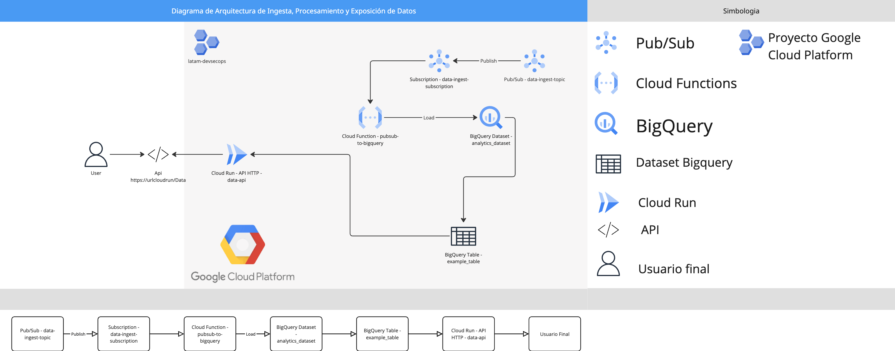

# Desafío Técnico DevSecOps/SRE - LATAM Airlines

## Introducción
### Contexto
En Advanced Analytics de LATAM Airlines, se construyen productos de datos que, al ser consumidos, añaden valor a diferentes áreas de la aerolínea. Los servicios exhiben datos obtenidos por procesos de analítica mediante APIs, tablas y procesos recurrentes. Uno de los principales pilares de nuestra cultura es la resiliencia y calidad de lo que construimos. Esto nos permite preservar la correcta operación de nuestros servicios y no deteriorar el valor añadido hacia el resto de áreas.

## Objetivo del Desafío
El desafío técnico DevSecOps/SRE tiene como objetivo desarrollar un sistema en la nube para ingestar, almacenar y exponer datos mediante el uso de Infraestructura como Código (IaC) y despliegue con flujos CI/CD. Además, se busca implementar pruebas de calidad, monitoreo y alertas para asegurar y monitorear la salud del sistema.

## Solución Propuesta
### Arquitectura del Sistema
La solución diseñada consta de los siguientes componentes:

#### Ingesta de Datos:
- Utilización de Google Cloud Pub/Sub para recibir mensajes con los datos.
- Suscripción a un tópico para asegurar la recepción de todos los mensajes enviados al sistema.

#### Procesamiento:
- Uso de una Cloud Function que, al recibir un mensaje de Pub/Sub, procesa la información y la inserta en un dataset de Google BigQuery.
- Los datos se almacenan en una tabla llamada `example_table` dentro del dataset `analytics_dataset` para poder ser consultados posteriormente.

#### Exposición de Datos:
- Se levanta un endpoint HTTP utilizando Google Cloud Run. Este endpoint sirve para exponer los datos almacenados en BigQuery a través de una API llamada `data-api`.
- Los usuarios finales pueden consumir los datos almacenados en BigQuery mediante solicitudes HTTP GET al endpoint `/data`.

### Diagrama de Arquitectura
*Nota: El diagrama muestra el flujo de datos desde la ingesta hasta la exposición, destacando los diferentes servicios de Google Cloud utilizados, tales como Pub/Sub, Cloud Function, BigQuery y Cloud Run.*


## Descripción de la Infraestructura
La infraestructura necesaria para ingestar, almacenar y exponer datos se implementó utilizando Terraform, siguiendo el principio de Infraestructura como Código (IaC). A continuación, se describen los componentes principales:

### Provider de Google Cloud
```hcl
provider "google" {
  project = var.project_id
  region  = var.region
}
```

### Pub/Sub para Ingesta de Datos
- **Tópico**: `data-ingest-topic`
- **Suscripción**: `data-ingest-subscription`

```hcl
# Tópico de Pub/Sub
resource "google_pubsub_topic" "data_ingest" {
  name = "data-ingest-topic"
}

# Suscripción a Pub/Sub
resource "google_pubsub_subscription" "data_ingest_sub" {
  name  = "data-ingest-subscription"
  topic = google_pubsub_topic.data_ingest.name
}
```

### BigQuery para Almacenamiento
- **Dataset**: `analytics_dataset`
- **Tabla**: `example_table`

```hcl
# Dataset en BigQuery
resource "google_bigquery_dataset" "analytics_dataset" {
  dataset_id = "analytics_dataset"
}

# Tabla en BigQuery
resource "google_bigquery_table" "example_table" {
  dataset_id = google_bigquery_dataset.analytics_dataset.dataset_id
  table_id   = "example_table"

  schema = jsonencode([
    {
      name = "id"
      type = "INTEGER"
      mode = "REQUIRED"
    },
    {
      name = "name"
      type = "STRING"
      mode = "NULLABLE"
    }
  ])
}
```

### Cloud Run para Exponer la API
- **Servicio**: `data-api`

```hcl
# Servicio de Cloud Run
resource "google_cloud_run_service" "api_service" {
  name     = "data-api"
  location = var.region

  template {
    spec {
      service_account_name = google_service_account.data_api_sa.email
      containers {
        image = "us-east4-docker.pkg.dev/${var.project_id}/latam-devsecops-images/data-api:v1"
        env {
          name  = "PROJECT_ID"
          value = var.project_id
        }
      }
    }
  }

  traffic {
    percent         = 100
    latest_revision = true
  }
}
```

### Cloud Function para Procesar Datos
- **Función**: `pubsub-to-bigquery`

```hcl
# Cloud Function para procesar datos
resource "google_cloudfunctions_function" "pubsub_to_bigquery" {
  name                  = "pubsub-to-bigquery"
  description           = "Ingesta datos desde Pub/Sub a BigQuery"
  runtime               = "python39"
  available_memory_mb   = 256
  source_archive_bucket = google_storage_bucket.function_bucket.name
  source_archive_object = google_storage_bucket_object.function_source.name
  entry_point           = "ingest_data"
  service_account_email = google_service_account.function_sa.email

  event_trigger {
    event_type = "google.pubsub.topic.publish"
    resource   = google_pubsub_topic.data_ingest.id
  }

  environment_variables = {
    PROJECT_ID = var.project_id
    DATASET    = google_bigquery_dataset.analytics_dataset.dataset_id
    TABLE_NAME = google_bigquery_table.example_table.table_id
  }
}
```

### Cuentas de Servicio e IAM
Se crearon cuentas de servicio específicas para la API y la Cloud Function, asignándoles los roles necesarios para interactuar con los servicios de Google Cloud.

### Escaneo de Seguridad con Trivy
Durante el desarrollo del desafío, se realizó un análisis de seguridad utilizando Trivy para asegurar que la imagen Docker estuviera libre de vulnerabilidades críticas. A continuación se muestra el resultado del escaneo:

```
~/latam-challenge-devsecops  on main ------------------------------------------------------------------------ at 12:12:59 AM
> trivy image us-east4-docker.pkg.dev/latam-devsecops/latam-devsecops-images/data-api:v6
2024-10-13T00:13:02-03:00       INFO    [vuln] Vulnerability scanning is enabled
2024-10-13T00:13:02-03:00       INFO    [secret] Secret scanning is enabled
2024-10-13T00:13:02-03:00       INFO    [secret] If your scanning is slow, please try '--scanners vuln' to disable secret scanning
2024-10-13T00:13:02-03:00       INFO    [secret] Please see also https://aquasecurity.github.io/trivy/v0.56/docs/scanner/secret#recommendation for faster secret detection
2024-10-13T00:13:02-03:00       INFO    Detected OS     family="alpine" version="3.19.4"
2024-10-13T00:13:02-03:00       INFO    [alpine] Detecting vulnerabilities...   os_version="3.19" repository="3.19" pkg_num=48
2024-10-13T00:13:02-03:00       INFO    Number of language-specific files       num=1
2024-10-13T00:13:02-03:00       INFO    [python-pkg] Detecting vulnerabilities...

us-east4-docker.pkg.dev/latam-devsecops/latam-devsecops-images/data-api:v6 (alpine 3.19.4)

Total: 0 (UNKNOWN: 0, LOW: 0, MEDIUM: 0, HIGH: 0, CRITICAL: 0)
```

Este resultado muestra que no se encontraron vulnerabilidades en la imagen, lo cual asegura que el sistema cumple con los estándares de seguridad esperados.

## Parte 2: Aplicaciones y Flujo CI/CD
### API HTTP
#### Descripción
Se desarrolló una API utilizando Flask para exponer los datos almacenados en BigQuery. La API tiene un endpoint `/data` que, al recibir una petición GET, consulta los datos en BigQuery y los devuelve en formato JSON.

#### Código de la Aplicación (`app.py`)
```python
from flask import Flask, jsonify
from google.cloud import bigquery
import logging
import os

# Inicializar la aplicación Flask
app = Flask(__name__)

# Configurar logging
logging.basicConfig(level=logging.INFO)
logger = logging.getLogger(__name__)

# Obtener el PROJECT_ID desde las variables de entorno
PROJECT_ID = os.getenv("PROJECT_ID")

@app.route('/data', methods=['GET'])
def get_data():
    try:
        client = bigquery.Client()

        query = f"""
        SELECT * FROM `{PROJECT_ID}.analytics_dataset.example_table` LIMIT 10
        """
        logger.info(f"Ejecutando la consulta: {query}")
        query_job = client.query(query)

        results = [dict(row) for row in query_job.result()]
        logger.info(f"Resultados obtenidos: {results}")
        return jsonify(results), 200
    except Exception as e:
        logger.error(f"Error al consultar BigQuery: {e}", exc_info=True)
        return jsonify({"error": "Error al obtener datos"}), 500

if __name__ == '__main__':
    port = int(os.environ.get("PORT", 8080))
    app.run(host='0.0.0.0', port=port)
```

### Dockerfile
Se creó un Dockerfile optimizado para reducir vulnerabilidades y asegurar una imagen ligera y segura.

```dockerfile
# Usar una imagen base mínima de Python en Alpine Linux
FROM python:alpine3.19

# Establecer el directorio de trabajo
WORKDIR /app

# Instalar dependencias del sistema
RUN apk update && apk add --no-cache gcc g++ musl-dev libffi-dev

# Copiar y instalar dependencias de la aplicación
COPY requirements.txt .
RUN pip install --no-cache-dir -r requirements.txt

# Copiar el código fuente
COPY . .

# Exponer el puerto 8080
EXPOSE 8080

# Comando para ejecutar la aplicación
CMD ["python", "app.py"]
```

### Despliegue en la Nube mediante CI/CD
Se implementó un flujo CI/CD utilizando GitHub Actions para automatizar el proceso de construcción, pruebas y despliegue de la API.

#### Archivo de Workflow (`.github/workflows/ci-cd.yaml`)
```yaml
name: CI/CD Pipeline para Cloud Run Deployment Data

on:
  push:
    branches:
      - main
  pull_request:
    branches:
      - main

jobs:
  build:
    name: Construir Imagen Docker
    runs-on: ubuntu-latest
    steps:
      - name: Revisar repositorio
        uses: actions/checkout@v2

      - name: Configurar Docker Buildx
        uses: docker/setup-buildx-action@v2

      - name: Iniciar sesión en Google Artifact Registry
        env:
          GCP_PROJECT_ID: ${{ secrets.GCP_PROJECT_ID }}
          GCP_SA_KEY: ${{ secrets.GCP_SA_KEY }}
        run: |
          echo "$GCP_SA_KEY" | docker login -u _json_key --password-stdin https://us-east4-docker.pkg.dev/${{ secrets.GCP_PROJECT_ID }}

      - name: Construir y publicar imagen Docker
        env:
          IMAGE_TAG: ${{ github.sha }}
        run: |
          docker buildx build --platform linux/amd64 -t us-east4-docker.pkg.dev/${{ secrets.GCP_PROJECT_ID }}/latam-devsecops-images/data-api:$IMAGE_TAG -f Dockerfile --push .

  deploy:
    name: Desplegar en Cloud Run
    runs-on: ubuntu-latest
    needs: build
    steps:
      - name: Autenticarse con Google Cloud
        uses: google-github-actions/auth@v1
        with:
          credentials_json: ${{ secrets.GCP_SA_KEY }}

      - name: Configurar Google Cloud SDK
        uses: google-github-actions/setup-gcloud@v1
        with:
          project_id: ${{ secrets.GCP_PROJECT_ID }}

      - name: Desplegar en Cloud Run
        env:
          IMAGE_TAG: ${{ github.sha }}
        run: |
          gcloud run deploy data-api \
            --image us-east4-docker.pkg.dev/${{ secrets.GCP_PROJECT_ID }}/latam-devsecops-images/data-api:$IMAGE_TAG \
            --region us-east4 \
            --platform managed \
            --allow-unauthenticated \
            --set-env-vars PROJECT_ID=${{ secrets.GCP_PROJECT_ID }}
```

### Ingesta de Datos (Opcional)
Se implementó una Cloud Function que suscribe al tópico de Pub/Sub y procesa los mensajes para insertarlos en BigQuery.

#### Código de la Cloud Function (`main.py`)
```python
from google.cloud import bigquery
import base64
import json
import os

def ingest_data(event, context):
    client = bigquery.Client()
    dataset_id = os.environ.get('DATASET')
    table_id = os.environ.get('TABLE_NAME')
    project_id = os.environ.get('PROJECT_ID')

    # Decodificar el mensaje de Pub/Sub
    pubsub_message = base64.b64decode(event['data']).decode('utf-8')
    data = json.loads(pubsub_message)

    table_ref = client.dataset(dataset_id).table(table_id)
    table = client.get_table(table_ref)

    # Insertar fila en BigQuery
    errors = client.insert_rows_json(table, [data])
    if errors:
        print(f"Errores al insertar filas: {errors}")
    else:
        print("Datos insertados correctamente en BigQuery")
```

## Parte 3: Pruebas de Integración y Puntos Críticos de Calidad
### Pruebas de Integración Implementadas
#### Descripción
- **Prueba de Integración**: Se realiza una solicitud GET al endpoint `/data` y se verifica que la respuesta HTTP sea 200.
- **Prueba Funcional de Integridad de Datos**: Se valida que los datos esperados estén presentes en la respuesta.

### Argumentación
Estas pruebas aseguran que:
- La API está operativa y accesible.
- La conexión con BigQuery es exitosa.
- Los datos se están obteniendo y devolviendo correctamente.

### Otras Pruebas de Integración Propuestas
- **Pruebas de Respuesta a Datos Inesperados**: Enviar mensajes malformados a Pub/Sub y verificar que la Cloud Function maneja correctamente los errores sin detenerse.
- **Pruebas de Carga**: Simular múltiples solicitudes concurrentes al endpoint `/data` para evaluar el rendimiento y escalabilidad de la API.
- **Pruebas de Seguridad**: Implementar autenticación en la API y verificar que solo usuarios autorizados puedan acceder a los datos.

## Parte 4: Métricas y Monitoreo
### Métricas Propuestas
- **Tasa de Errores de la Cloud Function**: Monitorear la cantidad de ejecuciones fallidas.
- **Tiempo de Respuesta de la API**: Medir el tiempo promedio de respuesta para garantizar un rendimiento óptimo.
- **Número de Mensajes Pendientes en Pub/Sub**: Vigilar si hay acumulación de mensajes, lo que indicaría problemas en la ingesta.

### Herramienta de Visualización
Se propone utilizar Google Cloud Monitoring para recolectar y visualizar las métricas. Se pueden configurar paneles personalizados que muestren las métricas críticas.

## Parte 5: Alertas y SRE (Opcional)
### Reglas de Alertas y Umbrales
- **Tasa de Errores de la Cloud Function**: Alertar si la tasa de errores supera el 5% en un período de 5 minutos.
  - Argumentación: Una alta tasa de errores indica problemas en la ingesta de datos.

- **Tiempo de Respuesta de la API**: Alertar si el tiempo de respuesta promedio excede los 500 ms durante 5 minutos.
  - Argumentación: Un aumento en la latencia afecta la experiencia del usuario.

- **Mensajes Pendientes en Pub/Sub**: Alertar si hay más de 100 mensajes pendientes por más de 10 minutos.
  - Argumentación: Indica que la Cloud Function no está procesando los mensajes a tiempo.

### SLIs y SLOs
- **SLI de Disponibilidad de la API**: SLO: 99.9% de disponibilidad mensual.
  - Justificación: Asegura que la API esté disponible para los usuarios la mayor parte del tiempo.

- **SLI de Latencia de la API**: SLO: 95% de las solicitudes con tiempo de respuesta menor a 300 ms.
  - Justificación: Garantiza una experiencia de usuario satisfactoria.

- **SLI de Procesamiento de la Cloud Function**: SLO: Procesar el 99% de los mensajes en menos de 1 minuto desde su recepción.
  - Justificación: Asegura que los datos estén disponibles casi en tiempo real.

## Mejoras Futuras
- **Implementar Autenticación**: Proteger la API para que solo usuarios autorizados puedan acceder a los datos.
- **Optimizar la Ingesta de Datos**: Mejorar la Cloud Function para manejar mayores volúmenes de datos y reducir la latencia.
- **Ampliar Pruebas Automatizadas**: Incluir pruebas unitarias y de integración más exhaustivas.
- **Optimización de Costos**: Ajustar los recursos y configuraciones para reducir costos sin afectar el rendimiento.

## Cómo Ejecutar el Proyecto
### Prerrequisitos
- Cuenta de Google Cloud Platform con las APIs necesarias habilitadas:
  - Cloud Run
  - Cloud Functions
  - Pub/Sub
  - BigQuery
- Google Cloud SDK instalado y configurado.
- Terraform instalado.
- Docker instalado para pruebas locales.

### Instrucciones
#### Clonar el Repositorio
```bash
git clone https://github.com/alvarowops/latam-challenge-devsecops.git
```

#### Configurar Variables de Entorno
Crear un archivo `terraform.tfvars` en el directorio `terraform` con el siguiente contenido:

```hcl
project_id = "tu-id-de-proyecto"
region     = "us-central1"
```

#### Desplegar la Infraestructura con Terraform
```bash
cd terraform
terraform init
terraform apply
```

#### Construir y Publicar la Imagen Docker
Si no se utiliza el flujo CI/CD:

```bash
docker build -t gcr.io/tu-id-de-proyecto/data-api:latest -f Dockerfile .
docker push gcr.io/tu-id-de-proyecto/data-api:latest
```

#### Desplegar en Cloud Run
Si no se utiliza el flujo CI/CD:

```bash
gcloud run deploy data-api   --image gcr.io/tu-id-de-proyecto/data-api:latest   --platform managed   --region us-central1   --allow-unauthenticated   --set-env-vars PROJECT_ID=tu-id-de-proyecto
```

#### Probar el Endpoint de la API
Obtener la URL del servicio desplegado:

```bash
gcloud run services describe data-api --region us-central1 --format 'value(status.url)'
```

Realizar una solicitud GET al endpoint `/data`:

```bash
curl https://tu-url-de-cloud-run/data
```

## Recursos
- **API Endpoint**: `/data` - Exposición de datos almacenados en BigQuery.
- **Repositorio de Código**: GitHub
- **Docker Image**: Almacenada en Google Artifact Registry.

*Nota: Reemplaza `tu-id-de-proyecto` con el ID de tu proyecto de Google Cloud, respectivamente.*